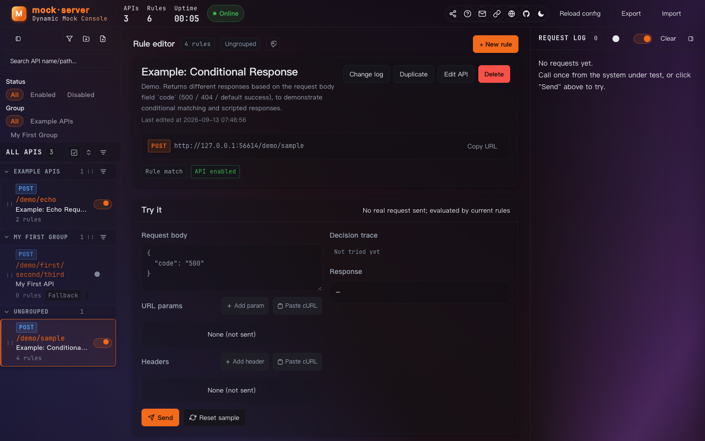
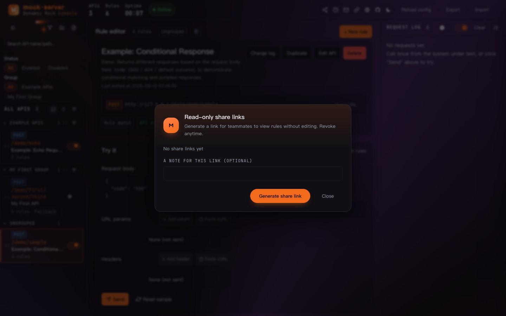

# Mock Server · Dynamic Mock Service with a Web Console

> Language: [English](README.en.md) ｜ [中文](README.md)

One configuration can host interfaces for multiple upstream services; **a single interface can return different responses based on the request content**. That is the core difference from "one endpoint = one hard-coded response" mock platforms: here "one interface = a list of conditional rules, return whichever rule matches".

Zero dependencies (Node built-in modules only), single process, change rules without restarting.



<p align="center"><sub>Console overview: left (interface list) · middle (rule editor + try-once) · right (live request logs) ｜ <a href="docs/shot-share.en.png">share-link dialog</a> ｜ <a href="docs/shot-help.en.png">web manual</a></sub></p>

---

## Quick start <!-- sec:quickstart -->

**Local (dev self-test)** — no `npm install`, Node ≥ 16:

```bash
git clone https://github.com/LeeJiEunm/mock-server.git
cd mock-server && node server.js     # console at http://127.0.0.1:18080/
```

**Server deploy (long-running for testers / project staff)** — one-click script auto-detects node, generates the systemd unit, and enables boot-start:

```bash
./deploy.sh <user>@<HOST_IP>          # default /opt/mock-server + port 18080
```

> Repository: <https://github.com/LeeJiEunm/mock-server> ｜ Author: LeeJiEunm ｜ Issues: <https://github.com/LeeJiEunm/mock-server/issues>

---

**Doc index**

| Doc | Reader |
| --- | --- |
| [docs/操作手册.en.md](docs/操作手册.en.md) | Testers / integration colleagues: task-oriented quick reference (deploy modes, share links, user mgmt, FAQ) |
| Console top-bar ❓ icon ([`public/help.html`](public/help.html)) | Everyone: web illustrated guide, also visible in read-only share view |
| This README | Deployers / maintainers: full rule syntax, deploy forms, admin API |

---

## 1. Background <!-- sec:background -->

This service is a **zero-dependency Node mock**, used to **replace real upstream interfaces during integration / testing**.

Its role is a generic, configurable interface simulator:

- returns **different responses dynamically** based on request fields (e.g. `code`) — success or various error codes;
- can simulate **service errors (500), timeouts (delay), business failures (custom status)** to cover positive and negative cases;
- with the "try-once" feature, you can verify rule matching without touching the real upstream.

The mock capability is generic (match by module + interface path, rules configurable): it can replace a single upstream interface, or take over an entire chain. This repo ships a `demo` module as an example; other modules can be entered via the UI or imported from a legacy mock platform (see [Section 11](#11-import-from-a-legacy-mock-platform)).

> ⚠️ For internal test networks only. Script mode executes JS directly — do not expose it to the public Internet.

---

## 2. Features <!-- sec:features -->

- **Zero dependencies**: Node built-in modules only (`crypto.randomUUID()`, etc.). No `npm install`; the whole directory is portable.
- **Dynamic rules**: each interface = "multiple conditional rules + a fallback response", first match wins.
- **Web console**: three panes — left (interface list) / middle (rule editor) / right (live logs). Saving takes effect immediately.
- **Rich matchers**: body / query / header / raw text; array wildcard `a[*].b`, regex, set, numeric comparisons, etc.
- **Scripted responses**: generate per-item responses from arrays in the request.
- **Proxy pass-through**: an interface can forward to the real service, ideal for "mostly real, a few stubbed" integration.
- **Themes**: auto / dark / light, pure CSS variables, no page reload.
- **Multiple deployment forms**: local (mac / win) via `node server.js`; server via systemd / plain / Docker.

---

## 3. Before you start (constraints) <!-- sec:must-know -->

These are the "you'll get burned without reading" items — skim them before deploying:

1. **⚠️ Internal test networks only.** Script mode executes JS; keep it on the test network, not public.
2. **⚠️ `config.json` is the single source of truth.** UI edits write back to the file immediately; editing the file directly requires "reload config" in the UI. Top level is `groups` + `apis`: `apis[].groupId` points to `groups[].id`; empty or deleted group → "ungrouped". Groups affect UI only, not routing.
3. **⚠️ Rules are first-match-wins.** A broad rule on top eats everything below.
4. **⚠️ Response shape must match the real interface.** The client has hard requirements on fields; missing fields cause NPE. When designing mock responses, always mirror the real interface's fields and types — required fields present, types consistent.
5. Mock paths must not start with `/_admin` (reserved for the admin API).
6. **Static assets only match root / `styles/` / `scripts/` / files with extensions like `.css .js .json .ico .png .svg`**; everything else is treated as a mock interface. So mock interface paths **must not carry static suffixes** (`/demo/query.json` would be treated as a static file).
7. Logs are in memory, cleared on restart, default 200 entries (`config.json` `logSize`).
8. Browser auto-requests `favicon.ico`, `/.well-known/*` **are not logged**; only real business calls appear.
9. **Interfaces on the same path can be split by HTTP method.** A `method` of `ALL` or an empty value matches any method; `GET` / `POST` etc. match only requests with that method. For the same path and method, first defined still wins.

---

## 4. Local Deployment (dev machine / integration) <!-- sec:local-deploy -->

Local deployment just runs the service on your own machine (macOS or Windows), opens the console in a browser to configure rules, and points the system-under-test's upstream address to this machine. No `npm install` needed.

### 4.1 macOS <!-- sec:local-mac -->

```bash
# 1) Ensure Node is present (>= 16 recommended)
node -v

# 2) Enter the project dir and start
cd mock-server
node server.js
```

After start:

- Console: http://127.0.0.1:18080/
- Mock entry: http://127.0.0.1:18080/{module}/{interface-path}

> If `config.json` is missing, the server copies `config.example.json` on first start —
> so a fresh clone runs with a plain `node server.js`, no manual setup.
> `config.json` is **runtime data** (everything you configure in the UI lives there) and is
> listed in `.gitignore`, so it is never committed.

> On macOS the upstream address is often `http://127.0.0.1:18080/demo`; do not end the URL with `/`.

### 4.2 Windows <!-- sec:local-win -->

On Windows install Node first, then start from PowerShell or CMD:

1. Download and install Node (LTS, >= 16) from https://nodejs.org, then verify in Command Prompt / PowerShell:

   ```powershell
   node -v
   ```

2. Enter the project dir and start:

   ```powershell
   cd mock-server
   node server.js
   ```

3. Open in browser:

   - Console: http://127.0.0.1:18080/
   - Mock entry: http://127.0.0.1:18080/{module}/{interface-path}

> If the system-under-test and the mock are on different machines, replace `127.0.0.1` with the mock machine's **LAN IP** (e.g. `http://192.168.x.x:18080/demo`), and ensure the firewall allows port 18080.

### 4.3 Common local operations <!-- sec:local-common -->

```bash
# Change port (PORT env > config.json server.port > default 18080)
PORT=18081 node server.js

# Passwordless + read-only share port (reproduce the "share link on a separate port" deploy form locally)
READONLY_PORT=18081 node server.js     # share link points to http://<host>:18081/?share=... (still read-only without ?share=)
```

> `READONLY_PORT` only rewrites the share link's host port under **passwordless deploy** (under account/password deploy the link stays on the main port, protected by login); it must differ from the main port. Passwordless without it → clicking "generate share link" in the UI returns 403.
>
> After editing `deploy.sh` you can run `tools/verify-deploy.sh` for a local self-check (fake-ssh sandbox, no real server needed).

**Console login protection** (guards the web admin UI only; calling mock APIs directly such as `/demo/...` is completely unaffected).

**Option 1: specify the admin via env vars at deploy time (most common)**

```bash
MOCK_ADMIN_USER=zhangsan MOCK_ADMIN_PASS=secret node server.js
```

- If `MOCK_ADMIN_USER` is omitted the username defaults to `admin`, i.e. `MOCK_ADMIN_PASS=secret node server.js` → log in with `admin / secret`.
- Neither set = no login protection; the console is open to anyone.
- The startup banner tells you which credentials are live, so you never have to guess (text follows the deployed default language):
  ```
  Console login : enabled (account zhangsan, from MOCK_ADMIN_USER / MOCK_ADMIN_PASS)
  ```
- Forgot the password? Change the env vars and restart; switching `MOCK_ADMIN_USER` invalidates the old account.

**Option 2: multiple accounts in `config.json` (one per teammate)**

Passwords are stored as scrypt hashes with a per-user random salt — use the bundled script to manage them:

```bash
node tools/add-user.js zhangsan secret     # add user / change password
node tools/add-user.js --list              # list accounts
node tools/add-user.js --remove zhangsan   # remove a user
```

Equivalent to editing the config by hand (`node tools/gen-pass.js yourpassword` prints the hash, format `scrypt:<salt>:<derived>` with a per-user random salt):

```json
{ "users": [
  { "username": "zhangsan", "passwordHash": "scrypt:<saltB64>:<derivedB64>" },
  { "username": "lisi",     "passwordHash": "scrypt:<saltB64>:<derivedB64>" }
] }
```

> Legacy `sha256:<hex>` entries from old configs still verify (migration period), but new passwords always use scrypt + a random salt to resist offline cracking.

Changes are hot-reloaded; no restart required.

**How the two combine**: env vars and `users` both take effect (env vars are checked first, then `users`), so both can be used side by side. Empty `users` + no env vars = login disabled.

**Console behaviour**: a successful login yields a 24-hour token stored in the browser; a failed login clears the password but keeps the username; while logged out the console issues no background polling, so input is never wiped and focus is never stolen mid-typing.

> This login protects **console access** only; it is unrelated to the **SSH deploy password** (`deploy.sh`) described in Server Deployment.

Port resolution order: `PORT` env > `config.json` `server.port` > `18080`.

### 4.4 Interface language (deploy-time default language) <!-- sec:local-lang -->

The console ships in **Chinese / English**, and the **login page also has a language switch** — at the bottom of the login card there are `中文 / English` buttons you can use before logging in; whichever you pick also changes the console copy after login.

**Set the default language at deploy time** (optional; defaults to Chinese if omitted):

```bash
# Make the console default to English at deploy time (use zh-CN for Chinese)
MOCK_DEFAULT_LANG=en MOCK_ADMIN_PASS=secret node server.js
```

- Values: `zh-CN` or `en` (aliases like `en` / `english` / `zh` / `zh-CN` are all normalized).
- Priority: `MOCK_DEFAULT_LANG` env > `config.json` `defaultLang` field > unspecified (Chinese).
- The startup banner prints the effective default language:
  ```
  Default language : en (from MOCK_DEFAULT_LANG)
  ```
- **Relationship between "deploy default" and "user's explicit choice"** (important): the deploy default only applies when the user has not yet clicked the language switch, and it is **not persisted** to the browser. So changing `MOCK_DEFAULT_LANG` and restarting instantly flips every user who hasn't manually chosen a language; but once a user clicks `中文 / English`, that choice is remembered (in `localStorage`) and no longer overridden by the deploy default — until they clear browser storage. This gives you a uniform initial language without freezing user preference into the deploy config.
- The top-bar 🌐 button switches language both before and after login; the login-page and console language selections stay in sync.

---

## 5. Server Deployment (test machine / long-running integration) <!-- sec:server-deploy -->

Server deployment targets an always-on test machine (Linux, typically CentOS 7 / Ubuntu). Three options:

- **One-click `deploy.sh`** (recommended): auto-detects node path, generates systemd unit, enables boot-start.
- **systemd manual**: for when you want to control the service file yourself.
- **Docker**: host does not need Node; Node runs inside the container.

### 5.1 Prerequisites <!-- sec:server-prereq -->

| Item | Notes |
| --- | --- |
| Node version | **>= 16**. Built-in modules only; verified to run on Node 14 as well. |
| glibc | CentOS 7 glibc is 2.17 and **cannot run Node 18+** (errors with `GLIBC_2.28 not found`). On CentOS 7 use the 16.x tarball, not yum's 18+. |
| SSH login | The script reuses a single SSH connection (ControlMaster), so you type the password only once per deploy and it is reused afterwards — **no SSH key setup required**. To skip the password on every future deploy, optionally run `ssh-copy-id` (optional, not required). |

Install Node 16 on CentOS 7 (without polluting system packages):

```bash
cd /tmp
curl -LO https://npmmirror.com/mirrors/node/v16.20.2/node-v16.20.2-linux-x64.tar.xz
mkdir -p /usr/local/nodejs
tar -xf node-v16.20.2-linux-x64.tar.xz -C /usr/local/nodejs --strip-components=1
ln -sf /usr/local/nodejs/bin/node /usr/local/bin/node
ln -sf /usr/local/nodejs/bin/npm  /usr/local/bin/npm
node -v        # expect v16.20.2
```

SSH login (optional): the script already handles the password via SSH connection reuse (see the table above), so **no manual key setup is needed**. To skip the password on every future deploy, optionally run (not required):

```bash
ssh-copy-id <user>@<HOST_IP>
```

### 5.2 One-click deploy (deploy.sh) <!-- sec:server-onclick -->

Run on **your machine** (where the package lives); the script ssh's to the target automatically:

```bash
cd mock-server
./deploy.sh <user>@<HOST_IP>
```

Options:

| Option | Meaning | Default |
| --- | --- | --- |
| `-p, --port` | Listen port | 18080 |
| `-r, --readonly-port` | Read-only isolation port (for share links; **required for passwordless deploy**) | off |
| `-d, --dir` | Remote install dir | /opt/mock-server |
| `-m, --mode` | systemd / plain / docker | auto (systemd preferred) |
| `-f, --force` | Also overwrite config.json (default keeps the remote one) | off |

Examples:

```bash
./deploy.sh root@<HOST_IP>                       # default /opt/mock-server + 18080
./deploy.sh root@<HOST_IP> -p 9090               # change port
./deploy.sh root@<HOST_IP> -d /data/mock-server  # change install dir
./deploy.sh root@<HOST_IP> -r 18081              # passwordless + read-only port 18081 (example port, change as needed)
./deploy.sh root@<HOST_IP> -m docker -p 7773     # container (host needs no node)
```

**Recommended: passwordless deploy for testers (read-only port 18081)**

```bash
cd mock-server
./deploy.sh root@<HOST_IP> -r 18081
```

- Not setting `MOCK_ADMIN_PASS` = passwordless: the main-port console is open to anyone and anyone can edit rules — fine for internal integration, **do not put it on the public Internet**.
- With `-r 18081` the script automatically: writes `Environment=READONLY_PORT=18081` into the systemd unit (or the launch command in plain / docker mode), covers both ports in the occupancy check, and opens both `18080` and `18081` in the firewall.
- On the read-only port `18081`: `/login` is disabled and any non-GET write returns 403; **every admin endpoint except `/_admin/auth` requires a valid share link** — hitting `/_admin/config`, `/_admin/share`, `/_admin/logs` etc. without a token returns 403 (enforced by the server, not just a front-end prompt), and the page shows "valid share link required".
- After generating a share link, the URL looks like `http://<HOST_IP>:18081/?share=shr-xxxx` — even if the other party strips `?share=`, it's still a read-only page and nothing can be changed.
- Security boundary: this isolation **only protects the share link**. The `18080` main port is unprotected; tighten it with the firewall to your own / internal subnet, and open `18081` only to testers.

> `-r` and `-p` cannot be equal (equal → server.js silently disables the read-only listener); the script errors out before deploy. A taken port also exits before deploy (including the read-only port), so you never end up with a "UI works but share link won't open" half-deploy.

Enable console login right at deploy time (optional, see 4.3; just **prefix the script with env vars**):

```bash
# explicit admin username + password
MOCK_ADMIN_USER=zhangsan MOCK_ADMIN_PASS=secret ./deploy.sh root@<HOST_IP>

# password only: username defaults to admin
MOCK_ADMIN_PASS=secret ./deploy.sh root@<HOST_IP>

# multiple accounts: write them into your local config.json, then ship it with -f
node tools/add-user.js zhangsan secret
./deploy.sh root@<HOST_IP> -f

# also set the deploy-time default language (en / zh-CN, see 4.4)
MOCK_DEFAULT_LANG=en MOCK_ADMIN_PASS=secret ./deploy.sh root@<HOST_IP>
```

The script writes these variables into the remote systemd unit (or the launch command in plain / docker mode) and prints `Console login enabled, account zhangsan` when done; to change the account or password, just rerun `./deploy.sh` with new env vars. The remote config lives at `<install dir>/config.json`, and `tools/add-user.js` + `tools/gen-pass.js` are uploaded too, so you can also run `node tools/add-user.js <user> <pass>` on the server.

> With login enabled, `/_admin/health` returns **401** when not logged in — that's expected (service is up, the console just needs a login). The script's health check accepts either 200 or 401.

The 7 automatic steps:

| # | Step | What it does |
| --- | --- | --- |
| 1 | Probe | Find remote node absolute path & version, detect systemd / docker |
| 2 | Stop old | Stop any running old instance on upgrade to avoid port conflict |
| 3 | Check port | Fail loudly if the port is taken; never silently hijack |
| 4 | Upload | `server.js` + `public/` + `tools/` + `config.example.json`; `config.json` kept by default (your rules). If you have no local `config.json` yet, the script ships `config.example.json` instead |
| 5 | Install | Generate systemd unit from real paths and `enable --now` |
| 6 | Health | Hit `/_admin/health`; **200 or 401 both count as ready** (401 = login protection on); print diagnostics on failure |
| 7 | Firewall | Open port if firewalld is active, else skip |

> The node absolute path is **probed** (`command -v node`); install dir and port are CLI args; the port ends up in the systemd unit's `Environment=PORT=` (read-only port → `Environment=READONLY_PORT=`). Nothing is hard-coded.

**Set maintainer info after deploy (email + repo URL)**

The console top-bar "Contact maintainer" (✉) and "GitHub" (repo icon) both read the `meta` field at the top of the remote `config.json` — **nothing is hardcoded in source**. The repo's email stays a placeholder; **set the real email only on the target machine** (so it doesn't get committed to git). The repo URL is public and ships with the real value.

One command to set both email and repo URL (replace `<install dir>` and the email with your own):

```bash
ssh <user>@<HOST_IP> 'bash -s' <<'REMOTE'
cd /opt/mock-server            # replace with your install dir
node - <<'JS'
const fs = require('fs');
const p = 'config.json';
const c = JSON.parse(fs.readFileSync(p, 'utf8'));
c.meta = Object.assign({ contactLabel: 'Maintainer' }, c.meta, {
  contactEmail: 'you@example.com',                          // your real contact email
  repoUrl: 'https://github.com/LeeJiEunm/mock-server',      // URL the top-bar GitHub button opens
  repoLabel: 'mock-server',
});
fs.writeFileSync(p, JSON.stringify(c, null, 2));
console.log('meta =', c.meta);
JS
REMOTE
```

- Takes effect immediately (the service watches config changes); if not, click "reload config" in the UI.
- `meta.repoUrl` only accepts `http(s)://` (config is externally editable — don't let `javascript:` reach `window.open`).
- These values can only be set via `config.json` (the UI shows them but cannot edit them).
- Rerunning `./deploy.sh` **does not overwrite the remote `config.json`** (kept by default), so what you set stays valid; only `-f` replaces it with the local copy.

### 5.3 systemd manual <!-- sec:server-systemd -->

Without the script, fill the 4 placeholders in `mock-server.service` and push it to the target:

```bash
# 1) Upload files (ship config.example.json when you have no local config.json — the server copies it on first start)
ssh <user>@<HOST_IP> 'mkdir -p /opt/mock-server'
scp -r server.js config.example.json public <user>@<HOST_IP>:/opt/mock-server/

# 2) Find node absolute path (write into the service file, don't copy /usr/bin/node blindly)
ssh <user>@<HOST_IP> 'command -v node'

# 3) Replace {{NODE_BIN}} {{REMOTE_DIR}} {{PORT}} {{RUN_USER}} in mock-server.service,
#    save it to /etc/systemd/system/mock-server.service
#    (to enable the read-only share port, add a line Environment=READONLY_PORT=18081 under [Service])

# 4) Start
ssh <user>@<HOST_IP> 'sudo systemctl daemon-reload && sudo systemctl enable --now mock-server'
```

### 5.4 Docker <!-- sec:server-docker -->

Host only needs docker + compose; no Node required:

```bash
# On the host. config.json is the volume-mount target and must exist first, otherwise
# docker mounts a directory over that path:  cp config.example.json config.json
MOCK_PORT=18080 docker compose up -d --build
```

- `MOCK_PORT` sets the host port (container-fixed 18080); `config.json` is volume-mounted to the host so rule edits persist.
- Container `restart: unless-stopped`, auto-starts after host reboot.
- **Don't hand-edit compose for the read-only port**: use `./deploy.sh <user>@<HOST_IP> -m docker -r <host readonly port>` — the script generates a `docker-compose.readonly.yml` overlay on the remote, maps `<host readonly port>` to **container port 18081**, injects `READONLY_PORT=18081` into the container, and starts with `-f docker-compose.yml -f docker-compose.readonly.yml`. The container read-only port must differ from the container main port (18080), so it's fixed at 18081 inside; which host port is exposed is decided by `-r`.

### 5.5 Boot-start & operations <!-- sec:server-ops -->

| Scenario | Command (on your machine, target `<user>@<HOST_IP>`) |
| --- | --- |
| Status | `ssh <user>@<HOST_IP> 'systemctl status mock-server'` |
| Restart | `ssh <user>@<HOST_IP> 'systemctl restart mock-server'` |
| Logs | `ssh <user>@<HOST_IP> 'journalctl -u mock-server -n 50 --no-pager'` |
| Boot-enabled? | `ssh <user>@<HOST_IP> 'systemctl is-enabled mock-server'` |
| Fetch config | `scp <user>@<HOST_IP>:/opt/mock-server/config.json ./config.json` |
| Redeploy port | `./deploy.sh root@<HOST_IP> -p 18081` |

- Host reboot → service comes up automatically (enabled).
- Process crash → `Restart=always` brings it back in 3s.
- 5 consecutive start failures → stop retrying (avoids log spam on bad config).
- **No "restart service" button in the UI on purpose**: rules don't need a restart (save = apply); only editing `server.js` does.

Health check:

```bash
curl -s http://<HOST_IP>:18080/_admin/health
# {"ok":true,"port":18080,"apis":2,"groups":1,"rules":6}
```

### 5.6 Update an existing deploy (upgrade) <!-- sec:server-upgrade -->

`deploy.sh` is **idempotent**: rerunning it on the same machine with the same args is an upgrade. Args (`-p` main port, `-d` install dir) must match the first deploy; add the read-only port as needed.

```bash
# 1) Rerun from your local repo dir (-p / -d must match first deploy, or you'll install a second service)
cd mock-server
./deploy.sh <user>@<HOST_IP> -p <main port> -d <install dir> -r <readonly port>

# 2) Verify
ssh <user>@<HOST_IP> 'curl -s http://127.0.0.1:<main port>/_admin/health'   # passwordless deploy returns JSON
ssh <user>@<HOST_IP> 'systemctl cat mock-server | grep -E "WorkingDirectory|Environment|ExecStart"'
```

**No need to back up `config.json` for an upgrade** — the script keeps the remote copy by default (see below). Only add `-f` on purpose, and then back up first (`cp config.json config.json.bak.$(date +%F)`).

- The script in order: stop old → check ports (incl. read-only) → upload `server.js` / `public/` / `tools/` → rewrite systemd unit → restart → health check → open ports.
- **The remote `config.json` is kept untouched by default** (interfaces / rules / `users` / `meta.contactEmail` / `shareTokens` all live there — it is the single source of truth). What gets updated is code & frontend (`server.js`, `public/`, `README.md`, `tools/add-user.js`+`gen-pass.js`) and the systemd unit (must be rewritten or new args won't apply); nothing is deleted.
- **Add `-f` only to force-overwrite**; `-f` replaces the whole file with your local copy, so back up first.
- After a frontend (`public/`) update, hard-refresh the browser (`Cmd+Shift+R`); the server needs nothing.
- Just changing args (port / read-only port) is also a rerun of `./deploy.sh` — no manual systemd editing.

---

## 6. Wire it into the system under test <!-- sec:wire-sut -->

Taking "point one of the system-under-test's upstream interfaces at the mock" as an example, change the system-under-test config (field names depend on your system; this is illustrative only):

```properties
upstream.service.demo.enabled=true
upstream.service.demo.url=http://<MOCK_ADDRESS>/demo     # no trailing /
upstream.service.demo.token=mock                       # mock ignores the token
```

The code builds `url + "/sample"`, so the request lands at
`http://<MOCK_ADDRESS>/demo/sample`, matching "module `demo` + interface `sample`".

**After integration, change the address back to the real upstream.**

Other services work the same: swap the module name, set the real interface path (may be multi-segment, e.g. `demo/query`).

The address is copyable from three places in the UI:

| Location | Gives you |
| --- | --- |
| Top of left pane | **service root address**, click "copy" |
| Interface card address bar | current interface's **full call address**, one-click copy |
| Hover on a left-pane interface | tooltip shows the full call address |

The host in the address is **the address you opened the UI with**, so opening `http://<HOST_IP>:18080/` yields `<HOST_IP>`, not 127.0.0.1.

---

## 7. Rule model <!-- sec:rule-model -->

```
request → find interface (module + interface path exact match)
        → proxy enabled? → forward to real service, done
        → try rules top-down: all/any conditions met = hit → return that rule's response
        → none hit → use the fallback response
```

Rules are tried top-down, **first match wins**. So:

- Put specific rules on top, broad rules below.
- Often set the last rule as "unconditional · always match" as the default.
- The "fallback response" is the last resort when no rule matches; it's configured separately from the rule list.

The `R1 / R2 / R3` badges in the UI are the match order, shown identically in logs — match the request's rule at a glance.

---

## 8. How to configure conditions <!-- sec:conditions -->

A condition = **source + path + operator + value**. Four dropdowns/inputs in the UI, no coding.

### Sources

| Source | Notes | Path example |
| --- | --- | --- |
| Body | JSON request body, by field | `code`, `items[*].code`, `data.list[0].code` |
| Query | `?a=1&b=2` params | `method` |
| Header | header, lowercase name | `x-mock-case`, `content-type` |
| Raw text | no parsing, whole body as text | (no path) |

Path supports:

- `a.b.c` — nested;
- `a[0].b` — array index;
- `a[*].b` — **array wildcard, any element match counts** (ideal for `items[*].code`).

### Operators

| Group | Operators | Notes |
| --- | --- | --- |
| Equal | `=` `≠` | numeric compare if both convertible, else string |
| Text | contains / not-contains / prefix / suffix / regex | regex uses `new RegExp(value)` |
| Set | in / not-in | value `A,B,C` comma-separated |
| Numeric | `>` `≥` `<` `≤` | numeric compare |
| Existence | exists / not-exists / empty / not-empty | no value needed |

Multiple conditions combine via "**all / any**".

### Response

| Item | Notes |
| --- | --- |
| HTTP status | any code, for error branches (500 / 502 / 404…) |
| Delay | ms, for timeout / loading / retry. **A single request holds for at most 30 seconds** — anything larger is capped at 30s (`MOCK_MAX_DELAY_MS` to change it) |
| Content-Type | default `application/json;charset=UTF-8` |
| Mode | **static text** or **script** |

> Both a delay and the `timeout` fault hold a connection open. Past 50 requests held at once, the
> extra ones get a **503** instead of queueing (the message names the reason), so the process cannot
> run out of file descriptors and take the admin UI down with it. Tune with `MOCK_MAX_HELD_REQUESTS`.

> The request log keeps only a **copy** of each body, at most **100KB** per entry: beyond that the
> text keeps the first 100KB and states the original size at the end, and the log entry carries
> `reqBodyTruncated` / `respBodyTruncated` (`{kept, total}`) — the detail drawer says so in plain
> words. **The body returned to the caller is always complete**; truncation only affects the log,
> never proxy pass-through. Tune with `MOCK_LOG_BODY_LIMIT` (bytes; 0 disables truncation).

**Static text** supports variable substitution:

| Var | Meaning |
| --- | --- |
| `{{body.field}}` | request body field (supports `{{body.data.list[0].code}}`) |
| `{{query.param}}` | URL param |
| `{{header.name}}` | request header |
| `{{vars.name}}` | interface-level variable (see below) |
| `{{now}}` `{{ts}}` `{{uuid}}` `{{random}}` | time / timestamp / UUID / random |

**Script** is for "generate different responses per item from a request array". Access
`ctx.body` / `ctx.query` / `ctx.headers` / `ctx.vars` and `helpers`, `return` an object or string:

```js
// ctx.body: request body; ctx.vars: interface-level variables
const code = ctx.body.code || 'default';
return {
  code: 0,
  message: 'ok',
  data: {
    requestCode: code,
    echo: ctx.body
  }
};
```

A script error returns 500 with the error in the body for easy debugging.

Scripts run synchronously in a vm sandbox: 1s timeout and 64KB length cap by default (`MOCK_SCRIPT_TIMEOUT_MS` / `MOCK_SCRIPT_MAX_LEN`), so an infinite loop or oversized script returns 500 instead of freezing the whole server.

### Interface-level variables

`vars` in an interface config is reusable data for rules — typically a "key → value" table looked up by the script. The UI has no vars editor yet; edit `config.json` directly.

### Proxy pass-through

Enable proxy with a real service URL; once on, the interface's requests are **forwarded as-is**, rules are skipped. Ideal for "mostly real, a few stubbed" integration.

**How the upstream path is built**:

```
Proxy URL:    http://<real-service-root>        ← real service root
Interface:    module demo   +   path query
Upstream gets: http://<real-service-root>/query
                                        ^^^^^
                                        only the interface path; module not sent upstream
```

The module name is only for the mock's own entry matching (`/{module}/{interface}`); upstreams usually don't have it. If upstream needs the module, put it in the proxy URL: `http://host/demo`.

---

## 9. Using the console <!-- sec:console -->

Left = interface list (grouped), middle = rule editor, right = live logs, one line:

1. **New group** → left "+ 分组", name it (e.g. "示例接口" / "Example"). Groups only affect left-pane grouping, **not the call path**.
2. **New interface** → "+ 接口", fill name / module / path; the "call address" previews live, copy to the system-under-test.
3. **New rule** → "+ 新增规则", build conditions with dropdowns; save = apply.
4. **Reorder** → ↑ ↓ on each rule; rules are **first-match-wins**, a broad rule on top eats the rest.
5. **Try once** → fill body/params/headers in the middle box, click "send", **no network**; the right pane lists each rule's hit/skip and why, highlights the matched one, and shows what would be returned. A "try" tag is logged for later comparison.
6. **Logs** → right pane auto-refreshes every 3s; click any entry to expand request/response; click its rule badge to scroll & highlight the rule in the middle.

Group collapse state and theme choice persist in the browser locally.

### Group maintenance

| Action | Location |
| --- | --- |
| New group | left "+ 分组" |
| Rename / delete | ✎ / ✕ on the group title (deleting a group does not delete its interfaces; they fall to "ungrouped") |
| Collapse / expand | ▾ / ▸ on the group title |
| Move interface to another group | open the interface's "edit", change "group" |

"Ungrouped" is a fallback pseudo-group: empty `groupId`, or pointing to a deleted group, lands here; it cannot be renamed or deleted.

### Theme

Top-right **auto / dark / light**, pure CSS variables, no reload:

- **dark** (default): warm-black industrial, easy on the eyes for long sessions;
- **light**: warm-white with white cards, clearer for projection / screenshots;
- **auto**: follows the OS dark/light setting.

Top bar also has: **reload config** (after editing `config.json`), **export**, **import** (backup / migrate).

### Read-only share links (let colleagues view rules)

Top-bar **share icon** → "generate share link". Each link has a **copy icon** on the left (hover shows "copy link", click copies) and can be **revoked** on the right at any time:

- The other party can only view rules, **cannot change config** (the server also blocks writes as a backstop);
- After a link is revoked, opening it shows a "share link expired" page — it never degrades to an editable view;
- With `READONLY_PORT` (read-only isolation port) configured at deploy, the share link uses a separate port — **stripping `?share=` no longer even reads the config, let alone edits it** (that port requires a token on every endpoint except `/_admin/auth`, enforced by the server). Passwordless deploy must configure it or clicking "generate" returns 403.
- Just add it to the one-click deploy: `./deploy.sh <user>@<HOST_IP> -r 18081` (see 5.2). Link looks like `http://<HOST_IP>:18081/?share=shr-xxxx`; on the read-only port `/login` is disabled and writes return 403.
- A read-only identity (share link or read-only port) only ever sees the rules themselves: `/_admin/config` has `users` and `shareTokens` stripped, and the token list `/_admin/share` is open to editable identities only — holding one share link is not the same as holding every link and every account hash.



### Login & user management

| Item | Notes |
| --- | --- |
| Enable login | set `MOCK_ADMIN_PASS` at deploy (username defaults to `admin`, `MOCK_ADMIN_USER` overrides) |
| Deploy admin | env-var account; can add/remove normal users |
| Normal users | stored in `config.json` `users` (SHA-256 hash, no plaintext); after login click avatar → Users |
| Passwordless deploy | no `MOCK_ADMIN_PASS` and empty `users` → console open, no login |
| Calling mock APIs | **not affected by login**; the system-under-test needs no credentials |

### In-console help (❓ icon)

The ❓ next to the share icon opens the web manual (`public/help.html`) in a new tab: an illustrated guide for testers / integration colleagues — quick start, UI tour, rule config, try-once, logs, share links, FAQ. Single-file, zero-dependency, also visible in the read-only share view.

---

## 10. Admin API (scripting) <!-- sec:admin-api -->

| Method | Path | Purpose |
| --- | --- | --- |
| GET | `/_admin/health` | health (apis / groups / rules / uptime) |
| GET | `/_admin/auth` | auth state (whether login required, read-only share, share token expired) |
| POST | `/_admin/login` | login (body: `{username, password}`, returns session token) |
| GET | `/_admin/config` | read full config (incl. `groups`; **`users` / `shareTokens` are never sent**, not even to a read-only identity) |
| POST | `/_admin/config` | save full config (body is the config JSON; `users` / `shareTokens` are preserved server-side, safe to omit) |
| POST | `/_admin/reload` | re-read `config.json` from disk |
| GET / POST / DELETE | `/_admin/share` | read-only share links: list / generate / revoke (`?token=`; **listing is for editable identities only** — a share token or the read-only port gets 403) |
| GET / POST / DELETE | `/_admin/users` | login user management (deploy admin only) |
| GET | `/_admin/logs?limit=50` | recent request logs |
| POST | `/_admin/logs/clear` | clear logs |
| POST | `/_admin/test` | try once (body `{apiId, raw, body, query, headers}`, logs a "try" tag) |

> All except `health` / `auth` / `login` require `Authorization: Bearer <token>` (session or share token). Login protects only the web console and these admin APIs; calling mock APIs directly (e.g. `/demo/...`) is completely unaffected.

---

## 11. Import from a legacy mock platform <!-- sec:import-legacy -->

If the team previously used a "one hard-coded response" mock platform (e.g. `http://<LEGACY_MOCK_HOST>:8084/mock/mock.html`), interfaces can be migrated without re-entry:

```bash
node tools/import-legacy.js --dry-run                              # preview only
node tools/import-legacy.js                                        # import (default source in script constant)
node tools/import-legacy.js --from http://<LEGACY_MOCK_HOST>:8084/mock/admin/list
node tools/import-legacy.js --from /tmp/mocklist.json              # also supports a local JSON file
node tools/import-legacy.js --prune                                # also drop interfaces deleted on the legacy platform
```

**Legacy record → this mock mapping**

| Legacy field | Maps to |
| --- | --- |
| `module` + `path` | `apis[].module` + `apis[].path` (same full path as legacy) |
| first `module` | a **group** (legacy "module" is the grouping dimension) |
| `enableProxy` + `proxyUrl` | `proxy.enable` + `proxy.url` |
| `response` | **fallback response** (`defaultResponse.body`) |

Two design notes:

1. **Legacy response goes to the fallback, not an always-match rule**. The fallback is exactly "what to return when no rule matches", semantically matching the legacy hard-coded response; it's inactive while proxy is on and takes effect the moment proxy is off — add rules on top to upgrade it to a dynamic mock.
2. **`enableProxy=true` with a placeholder address (`xxx`, `test`) is forced off**. Such entries would just fire requests into the void; they return the recorded response instead, and the import lists them as a warning.

**Idempotent**: interface id is derived from the path (`legacy-xxx`), so re-running updates rather than duplicates — safe to sync periodically during transition.

After import, click "reload config" in the running service's UI; no restart needed.

---

## 12. Maintainer info (contact) <!-- sec:maintainer -->

Two top-bar entries read their values from the `meta` field at the top of `config.json` — **nothing is hardcoded in source**:

| Top-bar button | Reads | Notes |
| --- | --- | --- |
| Contact maintainer (✉) | `meta.contactEmail` / `meta.contactLabel` | Shows the email in a dialog, one-click copy |
| GitHub (repo icon) | `meta.repoUrl` / `meta.repoLabel` | Opens the repo in a new tab; **if unset it only shows a "repo URL not configured yet" toast** |

```json
{
  "meta": {
    "contactEmail": "maintainer@example.com",
    "contactLabel": "Maintainer",
    "repoUrl": "https://github.com/LeeJiEunm/mock-server",
    "repoLabel": "mock-server"
  }
}
```

- After saving `config.json` the console picks it up automatically (or click "Reload" in the panel / restart the service).
- `meta.repoUrl` only accepts `http(s)://` (the config is externally editable — don't let `javascript:` reach `window.open`).
- Cloning this repo, others only need to edit this `meta` block — no source changes required. Set the **real email on the target machine**, not in the repo (see 5.2 "Set maintainer info after deploy").

---

## 13. Directory layout <!-- sec:dir-layout -->

```
mock-server/
├── server.js              # service (zero deps)
├── config.example.json    # example config (**tracked**): copied on first start when config.json is missing
├── config.json            # interface & rule config (single source of truth; runtime data, **not tracked**)
├── public/
│   ├── index.html         # console page (CSS/JS use relative paths)
│   ├── help.html          # web manual (top-bar ❓; single-file, self-styled, no deps)
│   ├── help/              # manual screenshots (shot-console / shot-share; .en.png = English)
│   ├── styles/
│   │   ├── tokens.css     # design tokens: color, type scale, spacing, theme (dark/light)
│   │   ├── base.css       # reset, typography, focus, ambiance, motion fallback
│   │   └── components.css # components & layout
│   ├── scripts/           # console logic (vanilla JS, no framework, no build; split by feature,
│   │   │                  # loaded in order by index.html, sharing one global scope — order matters)
│   │   ├── i18n.js        # zh/en copy and multilingual rendering
│   │   ├── state.js       # global state, constants, local preferences
│   │   ├── core.js        # helpers, sample config & API templates, config I/O
│   │   ├── theme.js       # theme and sidebar collapse
│   │   ├── auth.js        # login state, read-only sharing, share links, user menu
│   │   ├── api-list.js    # topbar stats, left API list and focus
│   │   ├── groups.js      # generic dialogs and group management
│   │   ├── workspace.js   # workspace and read-only detail
│   │   ├── try-logs.js    # try-it, changelog, request logs
│   │   ├── drawer.js      # API / rule drawer
│   │   └── app.js         # render entry, event binding, batch mode, boot
│   └── sample-config.json # example config for offline preview only; not read at runtime
├── docs/
│   ├── 操作手册.en.md     # task-oriented quick reference (testers / integration, English)
│   └── shot-*.png         # screenshots for README and the manual (shot-*.en.png = English)
├── tools/                 # helper scripts, not deployed (server.js runs standalone and never requires them)
│   ├── lib/config.js      # shared by tools: locate the config file / seed it from the example
│   ├── lib/cdp.js         # shared by tools: launch headless Chrome / attach DevTools / screenshot / collect page JS errors
│   ├── lib/sandbox.js     # shared by tools: spin up an isolated copy in a temp dir to run self-checks (never touches the repo config.json)
│   ├── import-legacy.js   # import from legacy mock platform (idempotent, repeatable)
│   ├── add-user.js        # add/update/remove console login users (writes config.json users)
│   ├── gen-pass.js        # generate a password hash (scrypt, per-user random salt; format scrypt:<salt>:<derived>)
│   ├── verify-ui.js       # real-browser self-check: try-once / theme / type scale / contrast / narrow screen
│   ├── verify-login.js    # real-browser self-check: login wording / input not wiped / login boundary
│   ├── verify-docs.js     # doc-parity self-check: both READMEs must share the same section markers
│   ├── verify-server-basics.js # server-basics self-check: startup with missing/broken config.json, static-dir traversal guard
│   ├── verify-auth-security.js # auth self-check: login boundary / read-only share tokens / sessions
│   ├── verify-mock-limits.js   # limits self-check: request-body size, rule count and other caps really take effect
│   ├── verify-console-boot.js  # real-browser self-check: script assembly + zero boot errors + cross-file calls + interactions & language switch
│   └── verify-deploy.sh  # deploy-script local sandbox: fake ssh, asserts readonly port etc. land in remote config
├── Dockerfile
├── docker-compose.yml
├── mock-server.service    # systemd unit template (deploy.sh generates the real one)
├── deploy.sh              # one-click deploy: port/dir/readonly-port configurable, node path auto-detected
└── README.md
```

---

## 14. Typography & color (design intent) <!-- sec:typography -->

The UI follows an "**industrial utility**" direction: monospaced numerals, hairline borders, high information density, a single amber accent.

- Type scale 6 steps (`--text-xs` 12px → `--text-xl` 32px), adjacent step ratio ≥ 1.17.
- Weight mid-step added (`--fw-normal` 400 / `--fw-medium` 500 / `--fw-bold` 700); dense UIs lean on weight + size for hierarchy.
- Contrast measured against the worst background (`--color-faint` on `surface-3` ≥ 4.5:1).
- No hard-coded colors in components; all `var(--color-*)`, so themes don't break.

These are not eyeballed — they're guarded by assertions (see `tools/verify-ui.js`).

Login gets its own real-browser self-check (**start a server with login enabled first**):

```bash
MOCK_ADMIN_USER=admin MOCK_ADMIN_PASS=admin123 PORT=18080 node server.js   # in another terminal
node tools/verify-login.js http://127.0.0.1:18080/ admin admin123
```

It asserts 30 checks: CN/EN login wording (catching raw keys like `login.username` leaking into the UI), input not wiped and focus not stolen while typing, the wrong-password message plus "clear password, keep username", successful entry into the console, and mock APIs staying reachable without a login.

All self-checks can be run in one pass (each spins up its own sandbox, never touches the repo `config.json`, and needs no pre-started server):

```bash
npm run verify:all      # docs → core → auth → limits → basics → console
```

---

> **Doc parity**: the section markers of this file and `README.md` are guarded by `tools/verify-docs.js`. After editing either, run it to confirm the two structures stay in sync.
